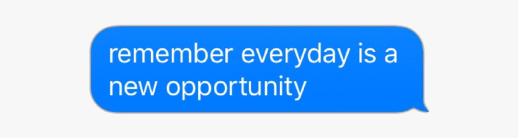

# 👋 Hey, I’m Vishen

<p align="center">
  
</p>

<h3 align="center">
  Building things, breaking things, learning fast.
</h3>

---

## 🚀 About Me

```txt
Developer focused on creating useful, scalable, and clean software.
Always learning.
Always improving.
```

- 🔭 Currently working on: **Your Current Project**
- 🌱 Learning: **Your Tech Stack / Interests**
- ⚡ Main stack: **TypeScript, Node.js, React, Go, Python**  
- 🧠 Interested in: **AI, systems, automation, open source**
- 🎯 Goal: Build products that actually matter

---

## 🛠 Tech Stack

### Languages


### Frontend


### Backend & DevOps


---

## 📌 Featured Projects

### 🔹 Project One
Short description of what it does and why it matters.

### 🔹 Project Two
Something interesting you built or are building.

### 🔹 Project Three
Automation, AI, tooling, or anything cool.

---

## 📈 GitHub Stats

<p align="center">
  
  
</p>

---

## 🌐 Connect

<p align="left">
  <a href="https://github.com/Vishen-dart-coder">
    
  </a>

  <a href="https://linkedin.com/in/vishen-sharma">
    
  </a>

  <a href="mailto:iamvishensharma@gmail.com">
    
  </a>
</p>

---

<p align="center">
  <i>"remember everyday is a new opportunity"</i>
</p>